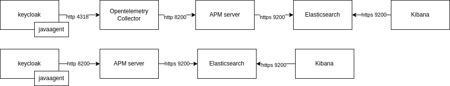

# POC Keycloak with tracing using Opentelemetry and Elasticsearch
This repostiry contains a complete stack that shows how to setup Keycloak with opentelemetry. It uses the opentelemetry-javaagent to enable the output of tracing information from Keycloak (Quarkus). 
There are two scenarios:
## 1. Sending the data straight to the Elastic APM server
This setup will send the data straight to the Elastic APM server without any processing in between
## 2. Sending the data to the Opentelemetry Collector first and then send it to Elastic APM Server
The tracing data is sent to Elasticsearch via the opentelemetry collector. This can be useful if there is a need to process the tracing data first or in the example send the data in batches



## How to use
```shell
# setup without opentelemetry collector
docker compose up -d
# setup with opentelemetry collector
docker compose up -d -f docker-compose-with-otel-collector.yaml
```
The following endpoints will be available
- Keycloak: http://localhost:8080 (admin/admin)
- Kibana: http://localhost:5601 (elasic/elastic)
- Elasticsearch: http://localhost:9200 (elasic/elastic)

A few other ports will also be available. Take a look at the compose files for more information.

click around for a bit in keycloak to generate some data. Creating a user is a good way to create some useful traces